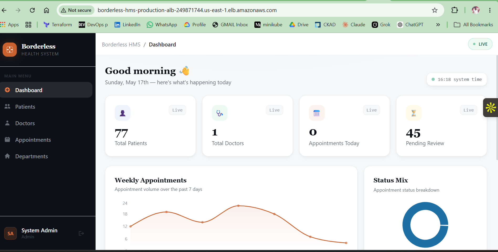
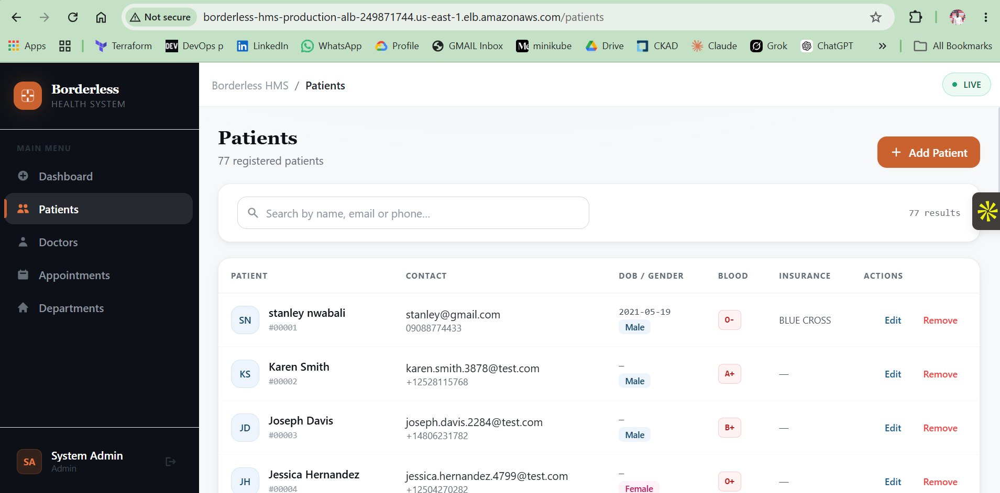
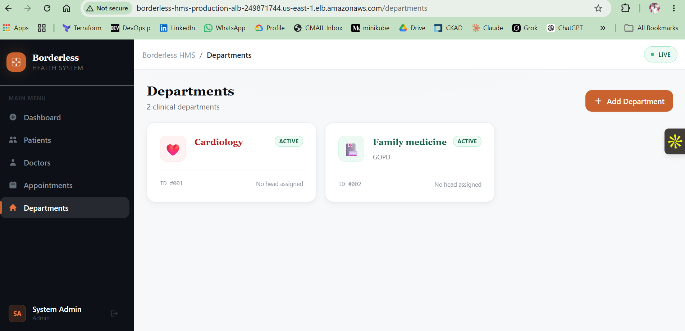
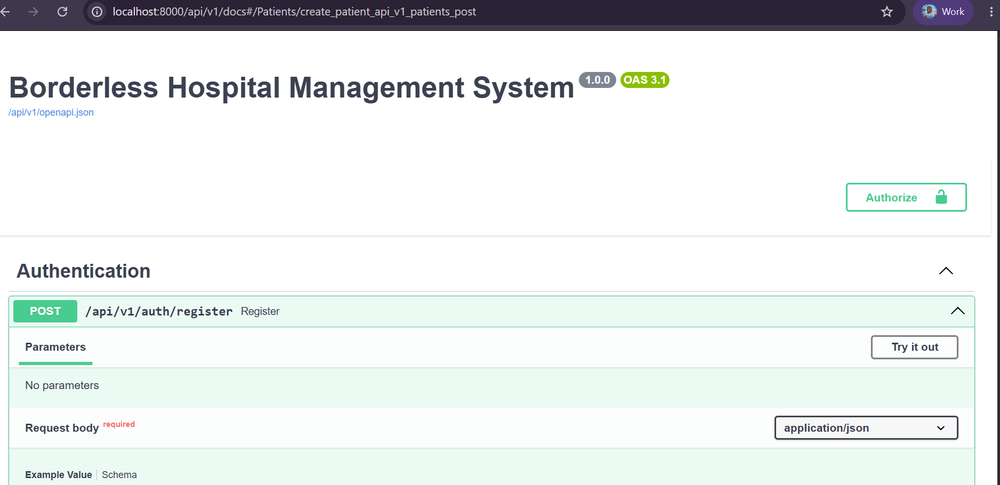
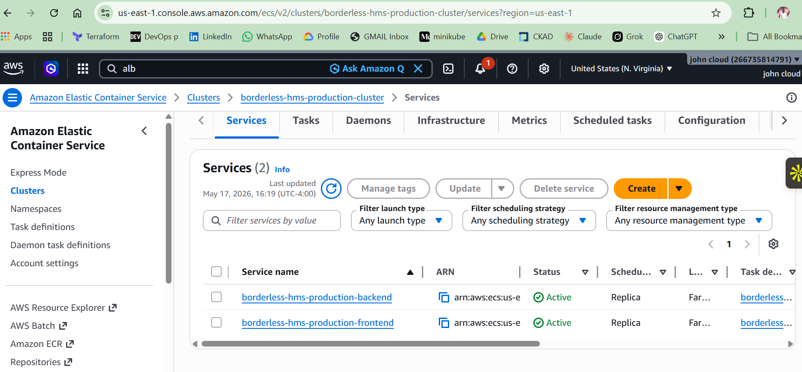
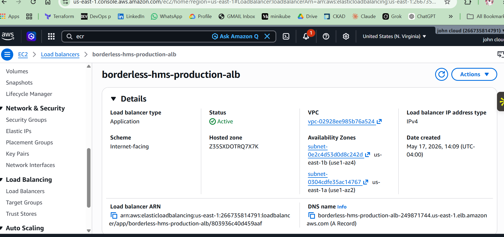
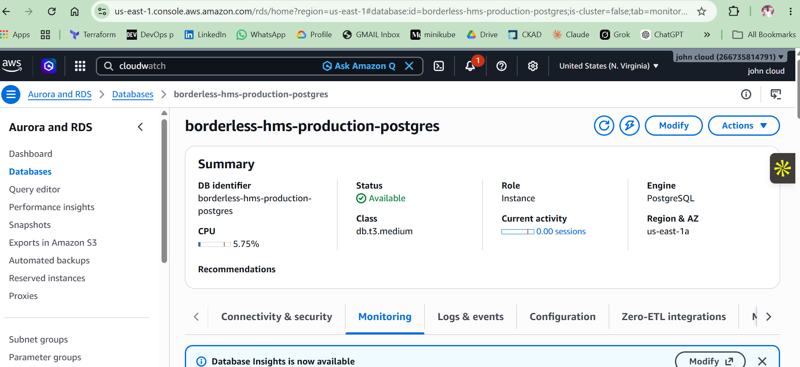

# 🏥 Borderless Hospital Management System

A full-stack, cloud-native hospital management system built with Python FastAPI for backend, React.js for frontend, and PostgreSQL for the database, deployed on AWS ECS Fargate with Terraform IaC and CI/CD via GitHub Actions.

> Author: Johntoby for Borderless Tech Academy


---

## 📋 Table of Contents

- [Features](#features)
- [Tech Stack](#tech-stack)
- [Architecture](#architecture)
- [Screenshots](#screenshots)
- [Getting Started](#getting-started)
- [Local Development](#local-development)
- [AWS Deployment](#aws-deployment)
- [API Documentation](#api-documentation)
- [Load Testing](#load-testing)
- [Cost Breakdown](#cost-breakdown)
- [Contributing](#contributing)
- [License](#license)

---

## Features

- **Patient Management** — Register, update, and track patient records
- **Doctor Management** — Manage doctor profiles and specializations
- **Appointment Scheduling** — Book, reschedule, and cancel appointments
- **Department Management** — Organize hospital departments
- **Dashboard & Analytics** — Real-time statistics and visualizations
- **Authentication & Authorization** — JWT-based auth with role-based access control
- **Auto-Scaling** — Handles up to 500 concurrent users on AWS
- **Observability** — Prometheus metrics, CloudWatch logs and alarms
- **Load Testing** — Locust-based performance testing suite

---

## Tech Stack

| Layer | Technology |
|-------|-----------|
| Frontend | React 18, Vite, Tailwind CSS, React Router, React Query, Recharts |
| Backend | Python 3.x, FastAPI, SQLAlchemy, Pydantic, Alembic |
| Database | PostgreSQL 16 |
| Auth | JWT (python-jose), bcrypt |
| Containerization | Docker, Docker Compose, Nginx |
| Cloud | AWS ECS Fargate, ALB, RDS, ECR, VPC, CloudWatch |
| IaC | Terraform |
| CI/CD | GitHub Actions |
| Load Testing | Locust |
| Monitoring | Prometheus, CloudWatch Alarms |

---

## Architecture

```
┌─────────────┐       ┌─────────────────────────────────────────────────┐
│   Client    │       │                  AWS Cloud                       │
│  (Browser)  │──────▶│  ALB ──┬──▶ ECS Frontend (React/Nginx)          │
└─────────────┘       │        │                                         │
                      │        └──▶ ECS Backend (FastAPI) ──▶ RDS (PG)   │
                      └─────────────────────────────────────────────────┘
```

| Component | Details |
|-----------|---------|
| Compute | ECS Fargate (serverless containers) |
| Database | RDS PostgreSQL 16, Multi-AZ, encrypted |
| Load Balancer | Application Load Balancer with path-based routing |
| Registry | Amazon ECR |
| Networking | VPC with public/private subnets across 2 AZs |
| Monitoring | CloudWatch Logs + Alarms, Prometheus metrics |

---

## Screenshots

| | |
|---|---|
|  |  |
|  |  |
|  |  |
|  |  |

---

##  Getting Started

### Prerequisites

- [Docker Desktop 24+](https://www.docker.com/products/docker-desktop/)
- [Git](https://git-scm.com/)
- (For AWS deployment) AWS CLI v2, Terraform >= 1.10.0

### Clone the Repository

```bash
git clone https://github.com/your-username/borderless-hms.git
cd borderless-hms
```

---

## 💻 Local Development

1. **Create a `.env` file** from the example:

```bash
cp .env.example .env
```

Update for local use:
```env
POSTGRES_SERVER=postgres
POSTGRES_PORT=5432
POSTGRES_USER=postgres
POSTGRES_PASSWORD=H0sp1talDev2024!
POSTGRES_DB=hospital_db
POSTGRES_SSL_MODE=disable
SECRET_KEY=local-dev-secret-key-change-in-production
ENVIRONMENT=development
DEBUG=true
BACKEND_CORS_ORIGINS=["http://localhost:3000","http://localhost:80","http://localhost:8080"]
```

2. Start all services:

```bash
docker compose up --build
```

3. Access the application:

| URL | Description |
|-----|-------------|
| http://localhost:8080 | Full app (via Nginx proxy) |
| http://localhost:8000/api/v1/docs | Swagger API documentation |

4. Default login:

| Username | Password | Role |
|----------|----------|------|
| admin | Admin@12345 | System Administrator |

5. Stop services:

```bash
docker compose down       # keeps data
docker compose down -v    # full reset (deletes database)
```

> For the full local development guide (pgAdmin, rebuilding, logs), see [localdev.md](localdev.md).

---

## AWS Deployment

The application deploys to AWS ECS Fargate using Terraform. The full step-by-step deployment guide is available in [aws-setup.md](aws-setup.md).

High-level steps:

1. Configure AWS CLI
2. Create `terraform.tfvars` with your secrets
3. Deploy ECR repositories
4. Build & push Docker images
5. Deploy full infrastructure (`terraform apply`)
6. Verify via ALB DNS URL

CI/CD is handled by GitHub Actions — every push to `main` triggers:
```
Build → Test → Push to ECR → Deploy to ECS → Verify
```

---

##  API Documentation

The backend exposes a full OpenAPI/Swagger UI at `/api/v1/docs`.

### Endpoints

| Group | Endpoints |
|-------|-----------|
| Auth | `POST /api/v1/auth/login`, `POST /api/v1/auth/register` |
| Patients | `GET/POST/PUT/DELETE /api/v1/patients` |
| Doctors | `GET/POST/PUT/DELETE /api/v1/doctors` |
| Appointments | `GET/POST/PUT/DELETE /api/v1/appointments` |
| Stats | `GET /api/v1/stats` |
| Health | `GET /health` |
| Metrics | `GET /metrics` (Prometheus) |

---

##  Load Testing

Load tests are written with [Locust](https://locust.io/) and located in the `load-tests/` directory.

```bash
cd load-tests
pip install locust
export LOAD_TEST_USERNAME=admin
export LOAD_TEST_PASSWORD=Admin@12345
locust -f locustfile.py --host=http://localhost:8080
```

Open http://localhost:8089 to configure and start the test.

**Production target:** 500 concurrent users with auto-scaling up to 20 ECS tasks.

---

##  Cost Breakdown (AWS Production)

| Service | Monthly Cost |
|---------|-------------|
| ECS Fargate (4 tasks) | ~$58 |
| RDS PostgreSQL (db.t3.medium, Multi-AZ) | ~$70 |
| ALB | ~$22 |
| NAT Gateway | ~$10 |
| ECR / CloudWatch / misc | ~$4 |
| **Total** | **~$164/month** |

See [aws-setup.md](aws-setup.md#cost-optimisation-tips) for tips on reducing costs for dev/staging environments.

---

##  Project Structure

```
borderless-hms/
├── backend/
│   ├── app/
│   │   ├── api/routes/       # FastAPI route handlers
│   │   ├── core/             # Config, security utilities
│   │   ├── db/               # Database models, session
│   │   ├── schemas/          # Pydantic schemas
│   │   └── main.py           # App entry point
│   ├── Dockerfile
│   └── requirements.txt
├── frontend/
│   ├── src/
│   │   ├── components/       # Reusable UI components
│   │   ├── context/          # React context providers
│   │   ├── pages/            # Page components (Dashboard, Patients, etc.)
│   │   ├── services/         # API service layer (Axios)
│   │   ├── App.jsx
│   │   └── main.jsx
│   ├── Dockerfile
│   ├── nginx.conf
│   └── package.json
├── load-tests/
│   └── locustfile.py         # Locust load test scenarios
├── screenshots/              # Application & infrastructure screenshots
├── .env.example              # Environment variable template
├── nginx-proxy.conf          # Local dev reverse proxy config
├── aws-setup.md              # AWS deployment guide
├── localdev.md               # Local development guide
├── architecture-diagram.png
└── LICENSE
```

---

##  Contributing

1. Fork the repository
2. Create a feature branch (`git checkout -b feature/your-feature`)
3. Commit your changes (`git commit -m 'Add your feature'`)
4. Push to the branch (`git push origin feature/your-feature`)
5. Open a Pull Request

---

##  License

This project is licensed under the MIT License — see the [LICENSE](LICENSE) file for details.

Copyright (c) 2026 John Idowu
